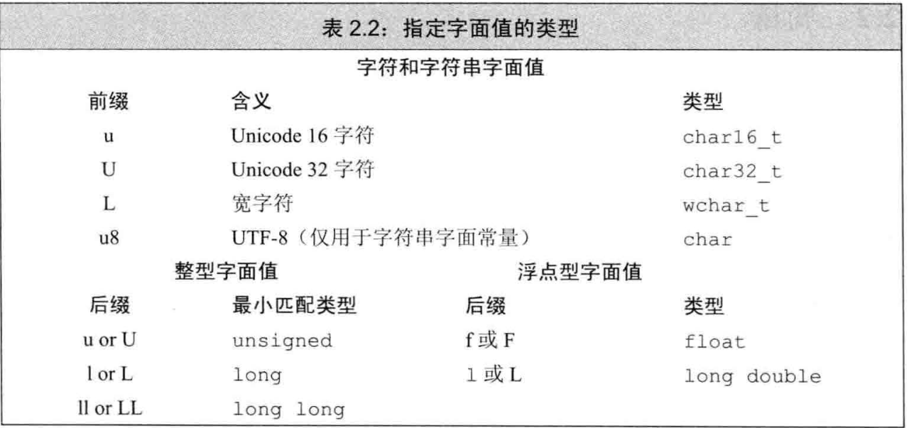

# 第二章 变量和基本类型

### 基本内置类型

**基本算数类型**：

| 类型 | 含义 | 最小尺寸|
|---|---|---|
| `bool` | 布尔类型  | 8bits |
| `char`| 字符 | 8bits |
| `wchar_t` | 宽字符 | 16bits |
| `char16_t` | Unicode字符 | 16bits |
| `char32_t` | Unicode字符 | 32bits |
| `short` | 短整型 | 16bits |
| `int` | 整型 | 16bits (在32位机器中是32bits) |
| `long` | 长整型 | 32bits |
| `long long` | 长整型 | 64bits （是在C++11中新定义的） |
| `float` | 单精度浮点数 | 6位有效数字 |
| `double` | 双精度浮点数 | 10位有效数字 |
| `long double` | 扩展精度浮点数 | 10位有效数字 |

c++ 规定 一个`int`至少和一个`short`一样大，一个`long`至少和一个`int`一样大，一个`long long `至少和一个`long`一样大 。

### 如何选择类型

- 1.当明确知晓数值不可能是负数时，选用无符号类型；
- 2.使用`int`执行整数运算。一般`long`的大小和`int`一样，而`short`常常显得太小。除非超过了`int`的范围，选择`long long`。
- 3.算术表达式中不要使用`char`或`bool`。
- 4.浮点运算选用`double`。（因为`float`通常精度不够，而使用`double`和使用`float`计算代价区别不是很大）

### 类型转换

- 非布尔型赋给布尔型，初始值为0则结果为false，否则为true。
- 布尔型赋给非布尔型，初始值为false结果为0，初始值为true结果为1。
- 浮点数赋给整型，进行了近似处理。结果值只保留了浮点数中小数点之前的部分。
- 整数值赋给浮点型，小数部分为0。
- 赋给无符号类型超过表示范围的值后，结果是初始值对无符号类型表示数值总数取模后的余数。e.g.  8比特大小的unsigned char可以表示0-255区间内的值，如果赋一个区间以外的值，实际结果是该值对256取模后的结果。-1赋给8比特unsigned char所得结果是255
- 赋给带符号类型一个超出范围的值时，结果是未定义的（undefined）

### 字面值常量

- 一个形如`42`的值被称作**字面值常量**（literal）。字面值常量的形式和值决定它的数据类型
  - 整型和浮点型字面值。
    - 整型字面值：有十进制、八进制、十六进制数的形式。`0`开头的整数表示八进制，以`0X`或者`0x`开头的代表十六进制
      e.g.  十进制`20`  八进制`024`   十六进制`0X14`     
    
    - 浮点型字面值：表现为一个小数或以科学记数法表示的指数，其中指数部分用`E`或`e`标识：
    
      ```c++
      3.14159 3.14159E0 0. 0e0 .001
      ```
  - 字符和字符串字面值。

    - 字符字面值：单引号括起来的一个字符， `'a'`
    - 字符串字面值：双引号括起来的0个或多个字符， `"Hello World"`字符串字面值的类型实际上是常量字符构成的数组（array）。字符串型实际上是常量字符构成的数组，结尾处以`'\0'`结束，所以字符串类型实际上长度比内容多1。
    - 分多行书写字符串。
      ```
      std:cout<<"wow, a really, really long string"
                "literal that spans two lines" <<std::endl;
      ```
  - 转义序列。`\n`、`\t`等。也可以使用泛化的转移序列，形式是`\x`后紧跟一个或多个十六进制的数字，或者`\`后紧跟1个，2个或3个八进制数字，其中数字部分表示的是字符对应的数值。`\`后如果跟着的八进制数字超过三个，只有前三个与`\`构成转义序列。“`\1234`”表示八进制123对应的字符以及字符4.`\x`要用到后面跟着的所有数字
  - 布尔字面值。`true`，`false`。
  - 指针字面值。`nullptr`

- 通过添加前缀或者后缀改变整型、浮点型和字符型字面值的默认类型

  

## 变量

**变量**提供一个**具名**的、可供程序操作的存储空间。   `C++`中**变量**和**对象**一般可以互换使用。

### 变量定义（define）

- **定义形式**：类型说明符（type specifier） + 一个或多个变量名组成的列表。如`int sum = 0, value, units_sold = 0;`
- **初始化**（initialize）：对象在创建时获得了一个特定的值。
  - **初始化不是赋值！**：

  - 初始化 = 创建变量 + 赋予初始值

  - 赋值 = 擦除对象的当前值 + 用新值代替

  - **列表初始化（list initialization）**：（C++11）使用花括号`{}`来初始化变量，

    如①`int units_sold = 0;`②`int units_sold = {0};`③`int units_sold{0};`④`int units_sold(0)`都表示定义了一个名为`units_sold`的`int`变量并初始化为0。

    如果我们使用**列表初始化**且初始化存在丢失信息的风险，则编译器会报错：

    ```c++
    long double ld = 3.1415926536;
    int a{ld},b = {ld};  // error:转换未执行，因为存在丢失信息的风险
    int c(ld),d = ld;    // 转换执行，且确实丢失了部分值
    ```

  - **默认初始化(default initialized)**：定义变量时没有指定初始值会被默认初始化，此时变量被赋予了“默认值”；。默认值是什么由变量类型决定，同时定义变量的位置也会对此有影响

    - 内置类型：如果是内置类型的对象未被显式初始化，它的值由定义的位置决定。定义于任何函数之外的变量被初始化为0；**定义在函数体内部的内置类型变量将不会被初始化**，一个未被初始化的内置类型变量的值是未定义的

      ```c++
      #include <iostream>
      int a;
      int main() {
      	int b;
      	return 0;
      }
      // a是0   b未定义
      ```

    - 每个类各自决定其初始化对象的方式。是否允许不经初始化就定义对象也由类自己决定。

### 变量的**声明**（declaration） vs **定义**（define）
  - 为了支持分离式编译，`C++`将声明和定义区分开。**声明**使得名字为程序所知。**定义**负责创建与名字关联的实体。

  - **extern**：只是说明变量定义在其他地方。

  - 只声明而不定义： 在变量名前添加关键字 `extern`，如`extern int i;//声明i而非定义i`。

    但如果包含了初始值，就变成了定义：`extern double pi = 3.14;//定义，抵消了extern的作用`

  - 变量只能被定义一次，但是可以多次声明。定义只出现在一个文件中，其他文件使用该变量时需要对其声明。

- 名字的**作用域**（`namescope`）`{}`
  - **第一次使用变量时再定义它**。
  - 嵌套的作用域
    - 同时存在全局和局部变量时，已定义局部变量的作用域中可用`::reused`显式访问**全局变量**reused。
    - **但是用到全局变量时，尽量不使用重名的局部变量。**

#### 变量命名规范
1. 需体现实际意义
2. 变量名用小写字母
3. 自定义类名一般用大写字母开头：Sales_item
4. 标识符由多个单词组成，中间须有明确区分：student_loan或studentLoan，不要用studentloan。

## 左值和右值

- **左值**（l-value）**可以**出现在赋值语句的左边或者右边，比如变量；
- **右值**（r-value）**只能**出现在赋值语句的右边，比如常量。


## 复合类型

### 引用

> 一般说的引用是指的左值引用
- **引用**：引用是一个对象的别名，引用类型引用（refer to）另外一种类型。如`int &refVal = val;//refVal 指向ival(是ival 的另一个名字)`。

- 引用必须被初始化。

  ```c++
  int ival = 1024;
  int &refVal = ival;
  int &refVal2; // error:引用必须被初始化
  ```

- 引用和它的初始值是**绑定(bind)**在一起的，而**不是拷贝**。一旦定义就不能更改绑定为其他的对象

- 因为引用本身不是一个对象，所以不能定义引用的引用

- 引用只能绑定在对象上，而不能与字面值或某个表达式的计算结果绑定在一起 

    e.g.`int &refVal = 10;// error `

- 引用的类型要和与之绑定的对象严格匹配（两种特殊情况除外，填坑1）

  例外1，在初始化常量引用时可以用任意表达式作为初始值，只要该表达式的结果可以转化成引用的类型即可。可以为常量引用绑定非常量的对象，字面值，甚至是一个一般表达式。

### 指针

> int *p;      //**指向int型对象**的指针

- 是一种 `"指向（point to）"`另外一种类型的复合类型。

- **定义**指针类型： `int *ip1;`，**从右向左读有助于阅读**，`ip1`是指向`int`类型的指针。

- 指针存放某个对象的**地址**。

- 获取对象的地址： `int i=42; int *p = &i;// p 存放变量i的地址，或者说p是指向变量i的指针`。 `&`是**取地址符**。

- 指针的类型与所指向的对象类型必须一致（均为同一类型`int`、`double`等）（两种情况例外，填坑2）

  例外1，允许令一个指向常量的指针指向非常量对象。

- 指针的值的四种状态：
  - 1.指向一个对象；
  - 2.指向紧邻对象所占空间的下一个位置；
  - 3.空指针，意味着指针没有指向任何对象；
  - 4.无效指针。
  - >**对无效指针的操作均会引发错误，第二种和第三种虽为有效的，但理论上是不被允许的**
  
- 指针访问对象： `cout << *p;`输出p指针所指对象的数据， `*`是**解引用符**。

- 空指针null pointer不指向任何对象。使用`int *p1=nullptr;`来使用空指针 `int *p2 = 0;`   `int *p3 = NULL;//包含#include <cstdlib>`。

- > 指针和引用的区别：引用本身并非一个对象，引用定义后就不能绑定到其他的对象了；指针并没有此限制，相当于变量一样使用。

- > 赋值语句永远改变的是**左侧**的对象。

- `void*`指针可以存放**任意**对象的地址。因无类型，仅操作内存空间，对所存对象无法访问。

  ```c++
  double obj = 3,14,*pd = &obj;
  // void *能存放任意类型对象的地址
  void *pv = &obj; // obj可以是任意类型的对象
  ```

  其他指针类型必须要与所指对象**严格匹配**。

- 两个指针相减的类型是`ptrdiff_t`。

  

## 指向指针的指针

```c++
int ival = 1024;
int *pi = &ival;// pi指向一个int型的数
int **ppi = &pi;// ppi 指向一个int型的指针
```

`ppi`是指向`int`型**指针的指针**

## 指向指针的引用

引用本身不是一个对象，因此不能定义指向引用的指针。但指针是对象，所以存在对指针的引用

```c++
int i = 42;
int *p;   //p是一个int型指针
int *&r = p; // r是一个对指针p的引用
r = &i;  //r引用了一个指针，因此给r赋值&i就是令p指向i
*r = 0;// 解引用r得到i,也就是p指向的对象，将i的值改为0
```

**从右往左**阅读r的定义。离变量名最近的符号对变量的类型有最直接的影响，&r,因此r是一个引用，符号*说明r引用的是一个指针，基本数据类型部分指出r引用的是一个`int`指针

## `const`限定符

- 动机：希望定义一些不能被改变值的变量。

### 初始化和`const`
- `const`对象**必须初始化**，且**不能被改变**。

- `const`变量默认不能被其他文件访问，非要访问，必须在指定`const`定义之前加`extern`。要想在多个文件中使用`const`变量共享，定义和声明都加`extern`关键字即可。

  ```c++
  // file_1.cc 定义并且初始化了一个常量，该常量能被其他文件访问
  extern const int bufSize = fcn();  // 一次定义
  // file_1.h 头文件
  extern const int bufSize;  // 与file_1.cc中定义的bufSize是同一个
  ```

  定义和声明都添加`extern`
  
  如果要想在多个文件之间共享`const`对象，必须在变量的定义之前加上`extern`关键字。

### `const`的引用

- **`reference to const`(对常量的引用)**：把引用绑定到`const`对象上，如 `const int ival=1; const int &refVal = ival;`，可以读取但不能修改`refVal`。

  ```c++
  const int ci = 1024;
  const int &r1 = ci;
  r1 = 42;// error ,r1 是对常量的引用
  int &r2 = ci; // error, 试图让一个非常量引用指向一个常量对象
  ```

  不允许直接为`ci`赋值，则也不能通过引用去改变`ci`

- **临时量**（temporary）对象：当编译器需要一个空间来暂存表达式的求值结果时，临时创建的一个未命名的对象。

- 对临时量的引用是非法行为。

- 常量引用仅对引用可参与的操作进行了限定，对于引用的对象本身是不是一个常量未作限定。因为对象也可能是个非常量，所以允许其他途径改变它的值。

```c++
int i = 42;
int &r1 = i;  // 引用r1绑定对象i
const int &r2 = i;  // r2也绑定i,但是不允许通过r2修改i的值
r1 = 0;      // r1非常量，i的值修改为0
r2 = 0;      // error:r2是一个对const的引用
```


**tip:**允许`const`引用绑定非`const`对象。不允许非`const`引用绑定`const`对象。

**tip:**允许指向`const`的指针指向非`const`对象。不允许指向非`const`的指针指向`const`对象。


### 指针和`const`

- **`pointer to const`（指向常量的指针）**：不能用于改变其所指对象的值。要想存放常量指针的地址，只能使用指向常量的指针。

```c++
const double pi = 3.14;
double *ptr = &pi;   // error:ptr是一个普通指针
const double *cptr = &pi;  // cptr指向double 常量
```

- 允许令一个指向常量的指针指向非常量

```c++
double dval = 3.14;
cptr = &dval
```

- 指向常量的指针仅仅要求不能通过指针改变对象的值，而没有规定对象的值不能通过其他路径改变。


- **`const pointer`（常量指针）**：指针本身是常量。常量指针必须初始化，一旦初始化完成，它的值（也就是存放在指针中的地址）就不能改变了。也就是说指针固定指向该对象，（存放在指针中的地址不变，地址所对应的那个对象值可以修改）如 `int i = 0; int *const ptr = &i;`

```c++
int errNumb = 0;
int *const curErr = &errNumb;  //curErr 将一直指向errNumb
// 把*放在const前面用以说明指针是一个常量，即不变的是指针本身的值而非指向的那个值
const double pi = 3.14159;
const double *const pip = &pi; //pip是一个指向常量对象的常量指针
```


### 顶层`const`

两个问题：指针本身是不是常量

​					指针所指向的值是不是常量

- `顶层const(top-level const)`：指针本身是个常量。

- `底层const(low-level const)`：指针指向的对象是个常量。

  ```c++
  int i = 0;
  int *const p1 = &i;        // 不能改变p1的值，顶层const
  const int ci = 42;         // 不能改变ci的值，顶层const
  const int *p2 = &ci;       // 允许改变p2的值，底层const
  const int *const p3 = p2;  // 靠右的const是顶层const，靠左的const是底层const
  const int &r = ci;         // 用于声明引用的const都是底层const
  ```

- 当执行对象的拷贝操作时，常量是顶层`const`还是底层`const`区别明显

  - 顶层`const`不受什么影响
  
  ```c++
  i = ci;  // 正确：拷贝ci的值，ci是一个顶层const，对此操作无影响
  p2 = p3;   // 正确：p2和p3指向的对象类型相同，p3顶层const的部分不影响
  ```
  
  - 底层`const`的限制不能忽视。当执行对象的拷贝操作时，**拷入和拷出的对象必须具有相同的底层`const`资格，或者两个对象的数据类型必须能够相互转换**。一般，非常量可以转化为常量，反之不行。
  
  ```c++
  int *p = p3;   //error:p3包含底层const的定义，而p没有
  p2 = p3;      // 正确：p2和p3都是底层const
  p2 = &i;      // 正确：int*能转换成const int *
  int &r = ci;   // error:普通的int& 不能绑定到const的int对象
  const int &r2 = i;  // 正确：const int&可以绑定到一个普通的int上
  ```
  

### `constexpr`和常量表达式

- **常量表达式：**指值不会改变，且在编译过程中就能得到计算结果的表达式。字面值属于常量表达式。用常量表达式初始化的`const`对象也是常量表达式。
- 一个对象是否为常量表达式由它的数据类型和初始值共同决定。

```c++
const int max_files = 20;           // max_files is a constant expression
const int limit = max_files + 1;    // limit is a constant expression
int staff_size = 27;        // 尽管staff_size是一个字面值常量，但是数据类型只是普通的而非const int，所以不属于常量表达式
const int sz = get_size();  //尽管sz本身是一个常量，但它的具体值直到运行时才能获取到，也不是常量表达式
```

- `C++11`新标准规定，允许将变量声明为`constexpr`类型以便由编译器来验证变量的值是否是一个常量的表达式。声明为`constexpr`的变量一定是一个常量，而且必须用常量表达式初始化

```c++
constexpr int mf = 20;          // 20 is a constant expression
constexpr int limit = mf + 1;   // mf + 1 is a constant expression
constexpr int sz = size();      // 只有当size是一个constexpr函数时才是一条正确的语句
```

- 指针和引用都能定义成`constexpr`，但是初始值受到严格限制。`constexpr`指针的初始值必须是0、`nullptr`或者是存储在某个固定地址中的对象。
- 函数体内定义的普通变量一般并非存放在固定地址中，因此`constexpr`指针不能指向这样的变量。相反，函数体外定义的变量地址固定不变，可以用来初始化`constexpr`指针。
- 在`constexpr`声明中如果定义了一个指针，限定符`constexpr`仅对指针本身有效，与指针所指的对象无关。**`constexpr`把它所定义的对象置为了顶层`const`**。

```c++
const int *p = nullptr;     // p是指向const int的指针
constexpr int *q = nullptr;     // q是指向int的const指针 
constexpr int i = 0;
constexpr const int *cp = &i;   // cp是指向const int的const指针

```

- 与其他常量指针类似，`constexpr`指针既可以指向常量也可以指向一个非常量

```c++
constexpr  int *np = nullptr;  // np是一个指向int的常量指针，其值为空

int j = 0;
constexpr int i = 42;    // i的类型是整型常量
// i j 都必须定义在函数体之外 因为（函数体外定义的变量地址固定不变，可以用来初始化`constexpr`指针。）
// 如果定义在函数内，则以下两条语句编译报错

constexpr const int *p = &i;  // p是常量指针，指向 const int型i
constexpr int *pi = &j;       // pi是常量指针，指向int型j 
```

- `const`和`constexpr`限定的值都是常量。但`constexpr`对象的值必须在编译期间确定，而`const`对象的值可以延迟到运行期间确定。
- 建议使用`constexpr`修饰表示数组大小的对象，因为数组的大小必须在编译期间确定且不能改变。

## 处理类型

### 类型别名（type alias）

类型别名是某种类型的同义词

- 传统别名：使用**typedef**来定义类型的同义词。 

```c++
typedef double wages;  // wages是double的同义词 
typedef wages base,*p; // base是double的同义词，p是double *的同义词
```

- 新标准别名：**别名声明（alias declaration）**，作用是把等号左侧的名字规定成等号右侧类型的别名。

   `using SI = Sales_item;// SI是Sales_item的同义词`（C++11）

```cpp
// 对于复合类型（指针等）不能代回原式来进行理解
typedef char *pstring;  // pstring是char*的别名
const pstring cstr = 0; // 指向char的常量指针
// 如改写为const char *cstr = 0;不正确，为指向const char的指针

// 辅助理解（可代回后加括号）
// const pstring cstr = 0;代回后const (char *) cstr = 0;  声明了一个指向char的const指针
// const char *cstr = 0;即为(const char *) cstr = 0;   声明了一个指向const char的指针
```

### auto类型说明符 c++11

- **auto**类型说明符：让编译器**自动推断类型**。`auto`定义的变量必须有初始值。

```c++
由val1和val2相加的结果来推断item的类型
auto item = val1 + val2;    // item初始化为val1和val2相加的结果
```

- 一条声明语句只能有一个数据类型，所以一个auto声明多个变量时只能相同的变量类型(包括复杂类型&和*)。

  ```c++
  auto sz = 0, pi =3.14   //错误:sz和pi的类型不一致 
  auto i = 0,*p = &i;     //正确:i是整型,p是整形指针
  ```

- 编译器推断出来的`auto`类型有时和初始值的类型并不完全一样。编译器会适当地改变结果类型使其更符合初始化规则

  - 当**引用**被用作初始值时，编译器以**引用对象的类型**作为`auto`的类型。

```c++
int i = 0,&r = i;
auto a = r;   // a是一个int(r是i的别名，而i是int)
```

​	`auto`一般会会忽略`顶层const`，底层`const`会被保留。

```c++
const int ci = i,&cr = ci;
auto b = ci;   // b是一个int(ci的顶层const被忽略)
auto c = cr;   // c是一个int(cr是ci的别名，ci本身是一个顶层const)
auto d = &i;   // d是一个int指针（整数的地址就是指向整数的指针）
auto e = &ci;  // e是一个指向int常量的指针（对常量对象取地址是一种底层const）
```

​	如果希望推断出的`auto`类型是一个顶层`const`，需要显式指定`const auto`。

```c++
const int ci = 1;
auto f = ci; // f是一个int，ci的顶层const特性被忽略掉了
const auto f = ci; //ci的推演类型是int，f是const int
```

- 设置类型为`auto`的引用时，原来的初始化规则仍然适用，初始值中的顶层常量属性仍然保留

```c++
auto &g = ci;   // g是一个int常量引用，绑定到ci
auto &h = 42;   // error:不能为非常量引用绑定字面值
const auto &j = 42;     // ok: 可以为常量引用绑定字面值
```

- 在一条语句中定义多个变量，要注意，符号`&` 、`*`只从属于某个声明符，而非基本数据类型的一部分，因此初始值必须是同一种类型

```c++
auto k = ci,&l = i;   //k是int,l是int引用
auto &m = ci,*p = &ci;  //m是对int常量的引用（设置类型为`auto`的引用时，初始值中的顶层常量属性仍然保留
// p是指向整型常量的指针

auto &n = i,*p2 = &ci;  // error:i的类型是int，&ci的类型是const int
```


### decltype类型指示符`c++11`

- C++11新增**`decltype`**类型指示符，作用是选择并返回操作数的**数据类型**，此过程中编译器分析表达式并得到它的类型，并不实际计算表达式的值。

```c++
decltype(f()) sum = x;  // sum的类型就是函数f的返回类型
```

- `decltype`处理顶层`const`和引用的方式与`auto`有些不同，如果`decltype`使用的表达式是一个变量，则`decltype`返回该变量的类型（包括顶层`const`和引用）。

```c++
const int ci = 0,&cj = ci;
decltype(ci) x = 0;  //x的类型是const int
decltype(cj) y = x;  //y的类型是const int&,y绑定到变量x
decltype(cj) z;   // error:z是一个引用，必须初始化
```

- 引用从来都是作为其所指的对象的同义词出现，只有在用`decltype`处是个例外。
- 如果`decltype`使用的表达式不是一个变量，则`decltype`返回表达式结果对应的类型。**如果表达式的内容是解引用操作，则`decltype`将得到引用类型。**（解引用指针可以得到指针所指的对象，而且还能给这个对象赋值。因此`decltype(*p)`的结果就是`int&`,而非`int`。）如果`decltype`使用的是一个不加括号的变量，则得到的结果就是该变量的类型；如果给变量加上了一层或多层括号，则`decltype`会得到引用类型，因为变量是一种可以作为赋值语句左值的特殊表达式。

```c++
// decltype的结果可以是引用类型
int i = 42,*p = &i,&r = i;
decltype(r+0) b;   //ok:加法的结果是int,因此b是一个（未初始化的）int
decltype(*p) c;   //error:c是int&，必须初始化
```

- `decltype`的表达式如果是加了括号的变量，结果将是引用   

  `decltype((variable))  // 双括号`的结果永远是**引用**。
  
  而`decltype(var)`的结果只有当*var*本身是一个引用时才会是引用。

## 自定义数据结构

### struct

> 尽量不要吧类定义和对象定义放在一起。如`struct Student{} xiaoming,xiaofang;`
- 类可以以关键字`struct`开始，紧跟类名和类体。
- 类数据成员：类体定义类的成员。
- `C++11`：可以为类数据成员提供一个**类内初始值**（in-class initializer）。创建对象时，类内初始值将用于初始化数据成员。没有初始值的成员将被默认初始化。或放在花括号里，或放在等号右边，不能使用圆括号。

```c++
struct Sales_data {
	std::string bookNo;
	unsigned units_sold = 0;
	double revenue = 0.0;
};
```

当定义`Sales_data`对象时，`units_sold` 和 `revenue`将被初始化为`0`，`bookNo`将初始化为空字符串。

### 编写自己的头文件

- 头文件通常包含哪些只能被定义一次的实体：类、`const`和`constexpr`变量。

预处理器概述：

- **预处理器**（preprocessor）：确保头文件多次包含仍能安全工作。
- 当预处理器看到`#include`标记时，会用指定的头文件内容代替`#include`
- **头文件保护符**（header guard）：头文件保护符依赖于预处理变量的状态：已定义和未定义。
  - `#indef`已定义时为真
  - `#inndef`未定义时为真
  - 头文件保护符的名称需要唯一，且保持全部大写。养成良好习惯，不论是否该头文件被包含，要加保护符。

```cpp
#ifndef SALES_DATA_H  //SALES_DATA_H未定义时为真
#define SALES_DATA_H
strct Sale_data{
    ...
}
#endif
```

