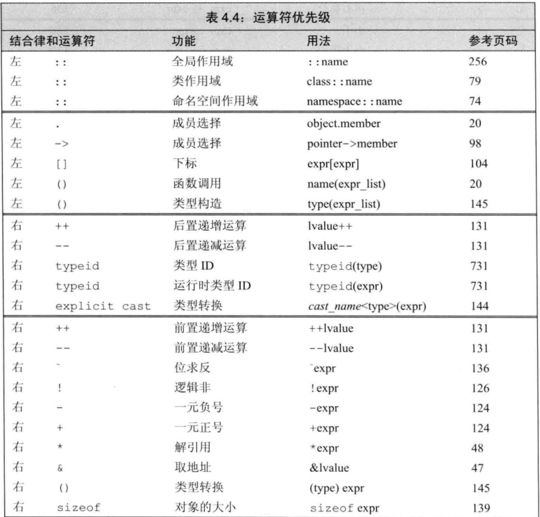
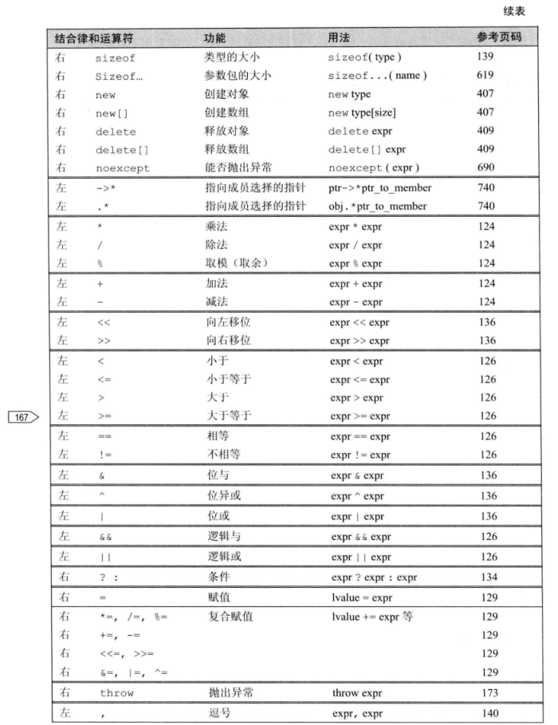

# 第四章 表达式

## 表达式基础

**表达式（expression）**由一个或多个**运算对象（operand）**组成，对表达式求值将得到一个**结果（result）**。字面值和变量是最简单的表达式，其结果就是字面值和变量的值。

- **一元运算符**   **二元运算符**

- **运算对象转换**：小整数类型（如`bool`、`char`、`short`等）会被**提升（promoted）**为较大的整数类型，主要是`int`
- **重载运算符(overloaded operator)**：当运算符作用在类类型的运算对象时，用户可以自行定义其含义。
- **左值(lvalue)和右值(rvalue)**：
    - C中原意：左值**可以**在表达式左边，右值不能。
    - `C++`：当一个对象被用作**右值**的时候，用的是对象的**值**（内容）；
    - 被用做**左值**时，用的是对象的**身份**（在内存中的位置）。
    - 需要右值的地方可以用左值代替，反之则不行

一些用到左值的：

- 赋值运算符需要一个非常量左值作为其左侧运算对象，返回结果也是一个左值

- 取地址符作用于左值运算对象，返回指向该运算对象的指针，该指针是一个右值。
- 内置解引用运算符、下标运算符、迭代器解引用运算符、`string`和`vector`的下标运算符都返回左值
- 内置类型和迭代器的递增递减运算符作用于左值运算对象。前置版本返回左值，后置版本返回右值。

如果`decltype`作用于一个求值结果是左值的**表达式**，会得到引用类型


### 优先级与结合律（Precedence and Associativity）

复合表达式（compound expression）指含有两个或多个运算符的表达式。优先级与结合律决定了运算对象的组合方式。

括号无视优先级与结合律，表达式中括号括起来的部分被当成一个单元来求值，然后再与其他部分一起按照优先级组合。

### 求值顺序 

`int i = f1() + f2()`

- 先计算`f1() + f2()`,再计算`int i = f1() + f2()`。但是f1和f2的计算**先后不确定**
- 但是，如果f1、f2都对同一对象进行了修改，因为顺序不确定，所以会编译出错，显示未定义

处理复合表达式时建议遵循以下两点：

- 不确定求值顺序时，使用**括号**来强制让表达式的组合关系符合程序逻辑的要求。
- 如果表达式改变了某个运算对象的值，则在表达式的其他位置不要再使用这个运算对象。

当改变运算对象的子表达式本身就是另一个子表达式的运算对象时，第二条规则无效。如`*++iter`，递增运算符改变了`iter`的值，而改变后的`iter`又是解引用运算符的运算对象。类似情况下，求值的顺序不会成为问题。

## 算术运算符

- **溢出**：当计算的结果超出该类型所能表示的范围时就会产生溢出。

- **bool类型不应该参与计算**
  
  ```cpp
  bool b=true;
  bool b2=-b;   //仍然为true
  //b为true，提升为对应int=1，-b=-1
  //b2=-1≠0，所以b2仍为true
  ```
  
- 取余运算m%n，结果符号与m相同

  ```c++
  cout << 8 % 3 << endl;  // 2
  cout << 8 % -3 << endl; // 2
  cout << -8 % 3 << endl; // -2
  cout << -8 % -3 << endl;  // -2
  ```

## 逻辑运算符

- **短路求值**：逻辑**与**运算符和逻辑**或**运算符都是先求左侧运算对象的值再求右侧运算对象的值，当且仅当左侧运算对象无法确定表达式的结果时才会计算右侧运算对象的值。**先左再右**

  即：

  - 对于逻辑与运算符来说，当且仅当左侧运算对象为真时才对右侧运算对象求值。

  - 对于逻辑或运算符来说，当且仅当左侧运算对象为假时才对右侧运算对象求值。

  

- 小技巧，声明为引用类型可以避免对元素的拷贝，如下，如string特别大时可以节省大量时间。
```cpp
vector<string> text;
for(const auto &s: text){   // const引用  不会修改值
  cout<<s;
}
```

## 赋值运算符

- 赋值运算的**返回结果是它的左侧运算对象**，且是一个**左值**。类型也就是左侧对象的类型。
- 如果赋值运算的左右侧运算对象类型不同，则右侧运算对象将转换成左侧运算对象的类型。
- 赋值运算符满足**右结合律**，这点和其他二元运算符不一样。 `ival = jval = 0;`等价于`ival = (jval = 0);`
- 赋值运算优先级比较低，使用其当条件时应该加括号。
- 复合赋值运算符(算术运算符`+=`、`-=`、`*=`、`/=`、`%=`、位运算符：`<<=`、`>>=`、`&=`、`^=`和`|=`)，**复合运算符只求值一次**，普通运算符求值两次。（对性能有一点点点点影响）
  任意复合运算符op等价于`a = a op b;`

## 递增递减运算符

* 前置版本`j = ++i`，先加一后赋值      前置版本首先将运算对象加1（或减1），然后将改变后的对象作为求值结果。
* 后置版本`j = i++`，先赋值后加一      后置版本也会将运算对象加1（或减1），但求值结果是运算对象改变前的值的副本

```cpp
int i = 0, j;
j = ++i;    // j = 1, i = 1: prefix yields the incremented value
j = i++;    // j = 1, i = 2: postfix yields the unincremented value
```

优先使用**前置**版本，后置多一步储存原始值。（除非需要变化前的值）

### 混用解引用和递增运算符

`*iter++`等价于`*(iter++)`，递增优先级较高

```c++
auto iter = vi.begin();
while (iter!=vi.end()&&*iter>=0)
	cout<<*iter++<<endl;	// 输出当前值，指针向前移1
//后置递增运算符优先级高于解引用运算符  *(iter++)
// pbeg++把pbeg的值加1，返回pbeg的初始值的副本作为其求值结果，此时解引用运算符对象是pbeg未增加之前的值。
// 这条语句输出pbeg开始指向的元素，并将指针向前移动一个位置
```

> **简洁是一种美德**，追求简洁能降低程序出错可能性

## 成员访问运算符

`ptr->mem`等价于`(*ptr).mem`

注意`.`运算符优先级大于`*`，所以记得加括号

- 箭头运算符作用于一个指针类型的变量，结果是一个左值
- 点运算符：如果成员所属的对象是左值，那结果是左值；如果成员所属对象是右值，那么结果是右值。

## 条件运算符

- 条件运算符（`?:`）允许我们把简单的`if-else`逻辑嵌入到单个表达式中去，按照如下形式：`cond? expr1: expr2`

- 可以嵌套使用，**右结合律**，从右向左顺序组合

  - ```c++
    string finalgrade = (grade > 90) ? "high pass"
        : (grade < 60) ? "fail" : "pass";
    //等价于
    string finalgrade = (grade > 90) ? "high pass"
        : （(grade < 60) ? "fail" : "pass"）;
    ```

- 输出表达式使用条件运算符记得加括号，条件运算符优先级太低。

## 位运算符

用于检查和设置二进制位的功能。

- 位运算符是作用于**整数类型**的运算对象，并把运算对象看成是二进制位的集合。
- 二进制位向左移（`<<`）或者向右移（`>>`），移出边界外的位就被舍弃掉了。

  位取反（`~`）（逐位求反）、与（`&`）、或（`|`）、异或（`^`）（在两个运算对象上逐位执行相应的逻辑操作）

有符号数负值可能移位后变号，所以强烈建议**位运算符仅用于无符号数**。

例子：

```c++
unsigned long quiz1 = 0;    // 每一位代表一个学生是否通过考试    unsigned long在任何机器上至少拥有32位
1UL << 12;  // 代表第12个学生通过     1UL是unsigned long类型的整型字面值1      左移12位 只有第12位为1
quiz1 |= (1UL << 12);   // 将第12个学生置为已通过
// 等价于 quiz1 = quiz1 | 1UL << 12;
quiz1 &= ~(1UL << 12);  // 将第12个学生修改为未通过
bool stu12 = quiz1 & (1UL << 12);   // 判断第12个学生是否通过
```

> 位运算符使用较少，但是重载`cout`、`cin`大家都用过

位运算符满足左结合律，优先级介于中间，使用时尽量加括号。

## `sizeof`运算符

- 返回一条表达式或一个类型名字所占的**字节数**。
- 返回的类型是 `size_t`的常量表达式。
- `sizeof`并不实际计算其运算对象的值。在`sizeof`的运算对象中解引用一个无效指针仍然是一种安全的行为，因为指针实际上并没有被真正使用。
- 两种形式：
  1. `sizeof (type)`，给出类型名
  2. `sizeof expr`，给出表达式
- 可用`sizeof`返回数组的大小

```c++
int ia[10];
// sizeof(ia)返回整个数组所占空间的大小
// sizeof(ia)/sizeof(*ia)返回数组的大小
constexpr size_t sz = sizeof(ia)/sizeof(*ia);
int arr[sz]; // sz是一个常量表达式
```

`sizeof`运算符的结果部分依赖于其作用的类型：

- 对`char`或者类型为`char`的表达式执行`sizeof`运算，返回值为1。
- 对引用类型执行`sizeof`运算得到被引用对象所占空间的大小。
- 对指针执行`sizeof`运算得到指针本身所占空间的大小。
- 对解引用指针执行`sizeof`运算得到指针指向的对象所占空间的大小，指针不需要有效。
- 对数组执行`sizeof`运算得到**整个数组**所占空间的大小。
- 对`string`或`vector`对象执行`sizeof`运算只返回该类型固定部分的大小，不会计算对象中元素所占空间的大小。

## 逗号运算符

从左向右依次求值。

左侧求值结果丢弃，逗号运算符**结果是右侧表达式**的值。

## 类型转换

### 隐式类型转换

无须程序员介入，会自动执行的类型转换叫做**隐式转换（implicit conversions）**

> 设计为尽可能避免损失精度，即转换为更精细类型。

- 比 `int`类型小的整数值先提升为较大的整数类型。
- 条件中，非布尔转换成布尔。
- 初始化中，初始值转换成变量的类型。在赋值语句中，右侧运算对象转换成左侧运算对象的类型。
- 算术运算或者关系运算的运算对象有多种类型，要转换成同一种类型。
- 函数调用时也会有转换。

#### 算术转换

##### 整型提升（integral promotion ）:负责将小整数类型转换成较大的整数类型

* 常见的`char`、`bool`、`short`、`unsigned char`、`signed char`、`unsigned short`，所有可能的值能存在`int`里就会转换成`int`，否则提升为`unsigned int`
* 较大的`char`类型（`wchar_t,char16_t,char32_t`）提升为整型中`int,long,long long ……`最小的，且能容纳原类型所有可能值的类型。

#### 其他转换

- **数组转换成指针**：在大多数表达式中，数组名字自动转换成指向数组首元素的指针

  ```c++
  int ia[10];
  int *ip = ia;  // ia转换成指向数组首元素的指针
  ```

  当数组被用作`decltype`关键字的参数，或者作为取地址符（&），`sizeof()`及`typeid`等运算符的运算对象时，上述转换不会发生。如果用一个引用来初始化数组，上述转换也不会发生。

- **指针的转换**：

  - 常量整数值0或字面值`nullptr`能转换成任意指针类型
  - 指向任意非常量的指针能转换成`void*`
  - 指向任意对象的指针能转换成`const void*`

- **转换成布尔类型**：

  - 任意一种算术类型或指针类型都能转换成布尔类型。如果指针或算术类型的值为0，转换结果是`false`，否则是`true`

- **转换成常量**：

  - 指向非常量类型的指针能转换成指向相应的常量类型的指针，对于引用也是这样。

    如果`T`是一种类型，能将指向`T`的指针或引用分别转换成指向 `const T`的指针和引用。

    相反的转换不存在，因为它试图删掉底层`const`

    ```c++
    int i;
    const int &j = i; // 非常量转换成const int的引用
    const int *p = &i; // 非常量的地址转换成const的地址
    int &r = j,*q = p; // error:不允许const转换成非常量  
    ```

- **类类型定义的转换**


### 显式类型转换（尽量避免）

​	显式类型转换也叫做**强制类型转换（cast）**

命名的强制类型转换（named cast）形式如下：

```c++
cast-name<type>(expression);
// type 是转换的目标类型    如果type是引用，则转换结果为左值。
// expression 是要转换的值
// cast-name 是`static_cast`、`dynamic_cast`、`const_cast`和`reinterpret_cast`中的一种，用来指定转换的方式
```

- **static_cast**：任何明确定义的类型转换，只要不包含底层`const`，都可以使用。 `double slope = static_cast<double>(j)/i;// i、j  int`

```c++
void *p = &d;   // 任何非常量对象的地址都能存入void*
double *dp = static_cast<double*>(p);  // 将void*转换回初始的指针类型
```


- **dynamic_cast**：支持运行时类型识别。

- **const_cast**：只能改变运算对象的底层`const`，一般可用于去除`const`性质。 `const char *pc; char *p = const_cast<char*>(pc)`。不能用`const_cast`改变表达式的类型。

  > 只有其可以改变常量属性

  `const_cast`常常用于有函数重载的上下文中

- **reinterpret_cast**：通常为运算对象的位模式提供低层次上的重新解释。很危险

#### 旧式强制类型转换

```c++
 type (expression);    // function-style cast notation  函数形式的强制类型转换
(type) expression;    // C-language-style cast notation  C语言风格的强制类型转换
```


## 运算符优先级表

> `p147`
>
> 


